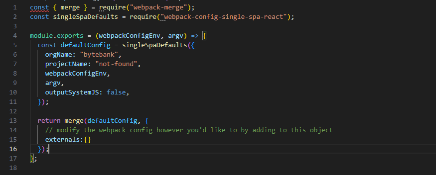

# Single SPA - Micro frontend

## 1 - Configuração do root (criação do orquestrador) 

`npx create-single-spa --moduleType root-config`

OBS.: Caso dê algum problema de versão não resolvida em relação a inicialização da página, executar o seguinte comando:
`npm cache clean --force`

As rotas são configuradas na importação do arquivo ejs


E o microfrontend é renderizado pelo html


## 2 - Criação de uma parcel

`npx create-single-spa --moduleType app-parcel`

Após a criação da parcel, que pode retornar um componente react (no exemplo deste repositório), é necessário configurar o mapeamento deste arquivo, lá no orchestrator.

Para mapear precisamos alterar dois arquivos:

- `index.ejs`: importando os arquivos dos outros projetos;
- `microfrontend-layout.html` : Controlando a exibição/layout destes componentes;

### Modificando o `index.ejs` 

O arquivo `.ejs` obedece uma linguagem de templates para html, e pode ser definida como:

"EJS, ou Embedded JavaScript, é uma linguagem de template simples que permite gerar HTML com JavaScript puro. Com EJS, você pode usar tags de scriptlet para inserir código JavaScript diretamente no seu HTML, facilitando a criação de páginas dinâmicas."

No exemplo abaixo, mapeamos todas as parcels que foram criadas, se atentando sempre para as portas em que cada uma está sendo executada pelo webpack.


### Modificando o `microfrontend-layout.html`

Dentro deste arquivo podemos organizar o layout e as rotas de nosso microfrontend. No exemplo abaixo, temos um componente "global" que é o nosso `navbar` e temos os outros componentes que são exibidos em cada rota.

Vale a pena dar atenção ao atributo `exact` que é colocado na tag `route` para deixar explicito que o componente só será exibido caso o caminho digitado seja exatamente aquele definido na propriedade `path`.


## 3 - Criação de um util

Para realizar a criação de um util, foi executado o comando:

`npx create-single-spa --moduleType util-module`

E após a sua criação, ele foi importado lá no arquivo `index.ejs`, seguindo o modelo de importação que foi registrado no tópico "2 - Criação de uma parcel".


## Extra: Modificações que tive que fazer para o projeto funcionar normalmente

### 1 - Criar um comando `start:port` no `package.json`

Ao executar o comando indicado pelo single-spa, que seria:

`npm start -- --port 8500`

A aplicação não ficava disponível na porta personalizada que era inserida no comando, por conta disso, tive que criar um novo comando na seção de scripts do `package.json` para que pudesse personalizar a porta em que a parcel seria executada.

O script inserido foi o seguinte:

`"start:port": "webpack serve --port"`

Para executá-lo usava a seguinte chamada:

`npm run start:port 8500`

E desse jeito a aplicação funcionava na porta desejada.

### 2 - Ajustar o `webpack.config.js`

Ainda não investiguei o motivo, porém, para o orquestrador conseguir acessar minha parcel, eu precisei modificar o arquivo `webpack.config.js` inserindo a linha:

`externals:{}`

dentro do retorno

```js
 return merge(defaultConfig, {
    externals:{}
  });
```

A imagem abaixo mostra o resultado final do arquivo



